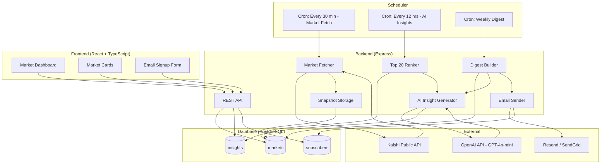
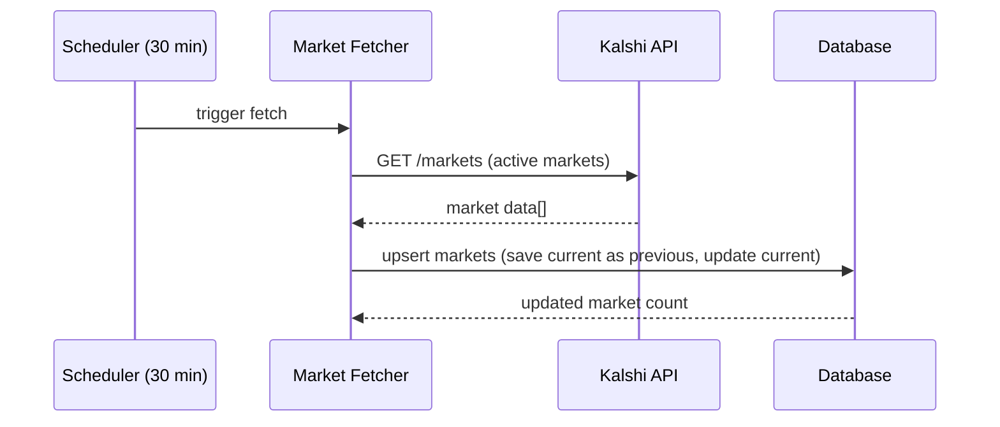
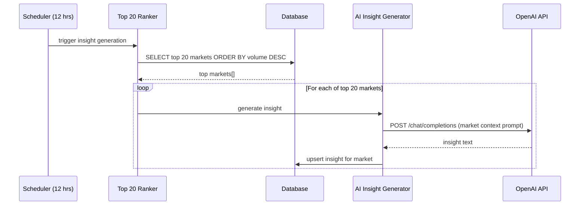
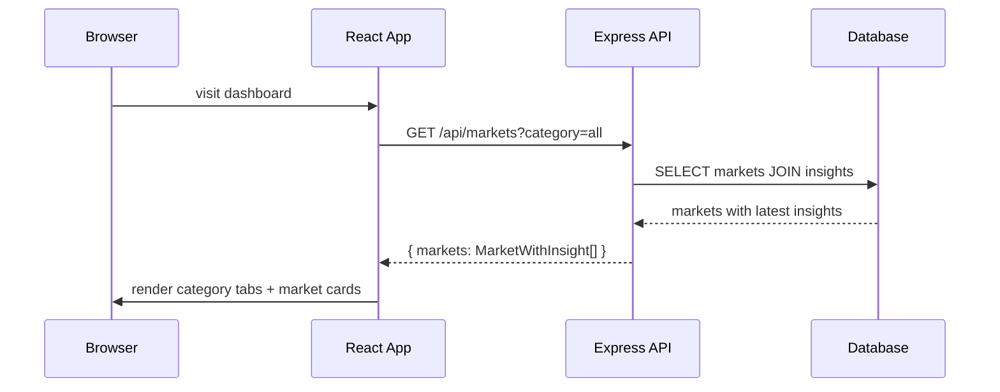
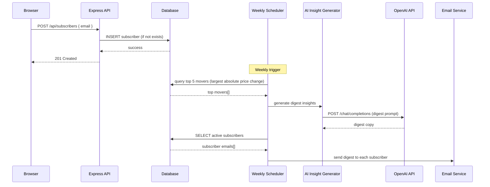

# Design Document: Prediction Pulse

## Overview

Prediction Pulse is a web application that fetches live prediction market data from Kalshi's public REST API, categorizes markets by topic (economy, politics, energy, climate), and uses OpenAI's GPT-4o-mini to translate raw contract prices into plain-English insights with actionable context. The target audience is small business owners, freelancers, and financially-aware individuals who want to make better decisions about things like refinancing, spending, hiring, and major purchases — not traders or quants.

The system runs on a polling architecture: a scheduler fetches market data every 30 minutes and stores snapshots for trend calculation. A separate 12-hour cycle selects the top 20 markets by volume and generates AI insights only for those — keeping OpenAI costs minimal (~6,000 tokens/day). Everything is served through an Express API to a React + TypeScript frontend. A weekly cron job compiles the top market movers into an email digest sent to subscribers via Resend/SendGrid. There are no user accounts, no real-time streaming, and no trading integration — just a clean dashboard and an email signup that doubles as a monetization signal.

The MVP is intentionally minimal. If 500 people give their email within 3 months without paid ads, there's signal worth pursuing.

## Architecture



## Sequence Diagrams

### Market Fetch (Every 30 Minutes)



### AI Insight Generation (Every 12 Hours)



### Dashboard Load



### Email Subscription & Weekly Digest



## Components and Interfaces

### Component 1: Market Fetcher

**Purpose**: Pulls active markets from Kalshi's public API and stores snapshots in the database for trend calculation.

```typescript
interface MarketFetcher {
  fetchActiveMarkets(): Promise<KalshiMarket[]>
  syncMarkets(markets: KalshiMarket[]): Promise<MarketSnapshot[]>
}

interface KalshiMarket {
  ticker: string
  title: string
  category: string
  yes_ask: number       // current probability (0-1)
  volume: number        // trading volume (used for ranking)
  status: string
}

interface MarketSnapshot {
  kalshiId: string
  title: string
  category: MarketCategory
  currentPrice: number
  previousPrice: number
  volume: number
  lastUpdated: Date
}
```

**Responsibilities**:
- Call Kalshi REST API for active markets
- Map Kalshi response to internal market model
- Categorize markets into known categories (economy, politics, energy, climate)
- Store volume for ranking (top 20 by volume are displayed on dashboard)
- Upsert market records: rotate `currentPrice` → `previousPrice`, set new `currentPrice`
- Return list of updated snapshots

### Component 2: AI Insight Generator

**Purpose**: Takes market data and produces plain-English insights using OpenAI's GPT-4o-mini. Runs every 12 hours on the top 20 markets by volume to minimize API costs.

```typescript
interface InsightGenerator {
  generateInsight(market: MarketSnapshot): Promise<Insight>
  generateTopMarketInsights(limit?: number): Promise<Insight[]>
  generateDigestInsights(markets: MarketSnapshot[]): Promise<DigestInsight[]>
}

interface Insight {
  marketId: string
  text: string
  generatedAt: Date
}

interface DigestInsight {
  market: MarketSnapshot
  insightText: string
}
```

**Responsibilities**:
- Build structured prompts from market data + category context
- Call OpenAI API with appropriate model and token limits
- Parse and validate response (ensure under 60 words, no financial advice)
- Store generated insights in database
- Generate batch insights for weekly digest

### Component 3: REST API

**Purpose**: Serves market data, insights, and handles subscriber management for the React frontend.

```typescript
interface MarketAPI {
  // GET /api/markets?category=:category
  // Returns top 20 markets by volume, optionally filtered by category
  getMarkets(category?: MarketCategory): Promise<MarketWithInsight[]>
  
  // POST /api/subscribers
  addSubscriber(email: string): Promise<void>
  
  // DELETE /api/subscribers/:email
  removeSubscriber(email: string): Promise<void>
}

interface MarketWithInsight {
  kalshiId: string
  title: string
  category: MarketCategory
  currentPrice: number
  previousPrice: number
  trend: TrendDirection
  trendPercent: number
  lastUpdated: string
  insight: string | null
}

type MarketCategory = 'economy' | 'politics' | 'energy' | 'climate'
type TrendDirection = 'up' | 'down' | 'stable'
```

**Responsibilities**:
- Serve paginated market data with joined insights
- Filter markets by category
- Validate and store email subscriptions
- Handle unsubscribe requests
- Return appropriate HTTP status codes and error messages

### Component 4: Email Digest Service

**Purpose**: Compiles weekly digest of top market movers and sends to active subscribers.

```typescript
interface DigestService {
  buildDigest(): Promise<DigestContent>
  sendDigest(content: DigestContent, subscribers: string[]): Promise<SendResult>
}

interface DigestContent {
  topMovers: DigestInsight[]
  generatedAt: Date
}

interface SendResult {
  sent: number
  failed: number
  errors: string[]
}
```

**Responsibilities**:
- Query top 5 markets by absolute price change over the past week
- Generate AI insights for each mover
- Format email content (HTML + plain text)
- Send to all active subscribers via Resend/SendGrid
- Log send results and failures

### Component 5: React Dashboard

**Purpose**: Displays categorized market cards with AI insights and provides email signup.

```typescript
interface DashboardProps {
  initialCategory?: MarketCategory
}

interface MarketCardProps {
  market: MarketWithInsight
}

interface EmailSignupProps {
  onSubscribe: (email: string) => Promise<void>
}
```

**Responsibilities**:
- Fetch and display markets grouped by category tabs
- Render each market as a card: question, probability, trend arrow, insight
- Provide email signup form with validation
- Show loading and error states
- Auto-refresh data on a reasonable interval (5 minutes)

## Data Models

### Market

```typescript
interface Market {
  id: number                  // auto-increment PK
  kalshiId: string            // unique, from Kalshi API
  title: string               // "Will the Fed cut rates before Oct?"
  category: MarketCategory    // "economy" | "politics" | "energy" | "climate"
  currentPrice: number        // 0.73 = 73% probability
  previousPrice: number       // for trend calculation
  volume: number              // trading volume, used for top-20 ranking
  lastUpdated: Date
}
```

**Validation Rules**:
- `kalshiId` must be non-empty and unique
- `title` must be non-empty, max 500 characters
- `category` must be one of the four allowed values
- `currentPrice` must be between 0 and 1 inclusive
- `previousPrice` must be between 0 and 1 inclusive
- `volume` must be a non-negative integer

### Insight

```typescript
interface Insight {
  id: number                  // auto-increment PK
  marketId: string            // FK → markets.kalshiId
  text: string                // AI-generated insight, max 60 words
  generatedAt: Date
}
```

**Validation Rules**:
- `marketId` must reference an existing market
- `text` must be non-empty, max 500 characters
- One active insight per market (upsert on generation)

### Subscriber

```typescript
interface Subscriber {
  id: number                  // auto-increment PK
  email: string               // unique, valid email format
  subscribedAt: Date
  active: boolean             // default true
}
```

**Validation Rules**:
- `email` must be valid email format and unique
- `active` defaults to `true`
- Soft delete via `active = false` (preserve for analytics)


## Key Functions with Formal Specifications

### Function 1: fetchAndSyncMarkets()

```typescript
async function fetchAndSyncMarkets(): Promise<MarketSnapshot[]>
```

**Preconditions:**
- Kalshi API is reachable
- Database connection is active
- `KALSHI_API_BASE_URL` environment variable is set

**Postconditions:**
- All active Kalshi markets are stored in the database
- For each market: `previousPrice` equals the old `currentPrice`, `currentPrice` equals the new value from Kalshi
- `lastUpdated` is set to the current timestamp for all updated markets
- Returns array of all updated market snapshots
- If Kalshi API fails, throws with descriptive error; database state is unchanged

**Loop Invariants:**
- For each processed market in the upsert loop: the market record in the database reflects the latest Kalshi data
- No partial updates: each market upsert is atomic

### Function 2: generateInsight()

```typescript
async function generateInsight(market: MarketSnapshot): Promise<Insight>
```

**Preconditions:**
- `market` is non-null with valid `kalshiId`, `title`, `category`, `currentPrice`
- `OPENAI_API_KEY` environment variable is set
- OpenAI API is reachable

**Postconditions:**
- Returns an `Insight` with non-empty `text` that is at most 60 words
- `insight.marketId` equals `market.kalshiId`
- `insight.generatedAt` is set to current timestamp
- Insight text does not contain direct financial advice (no "you should buy/sell")
- If OpenAI API fails, throws with descriptive error; no insight is stored

### Function 3: selectTopMarkets()

```typescript
function selectTopMarkets(
  markets: MarketSnapshot[], 
  limit: number
): MarketSnapshot[]
```

**Preconditions:**
- `markets` is a valid array (may be empty)
- `limit` is a positive integer

**Postconditions:**
- Returns at most `limit` markets from the input
- Result is sorted by `volume` descending
- If `markets.length <= limit`, returns all markets (sorted by volume)
- Every market in the result has `volume >= ` the volume of every market not in the result

**Loop Invariants:**
- N/A (uses sort + slice, no explicit loop)

### Function 4: buildAndSendDigest()

```typescript
async function buildAndSendDigest(): Promise<SendResult>
```

**Preconditions:**
- Database connection is active
- At least one market exists in the database
- Email service API key is configured
- OpenAI API key is configured

**Postconditions:**
- `result.sent + result.failed` equals total number of active subscribers
- Each active subscriber received exactly one email (or is counted in `failed`)
- Digest contains at most 5 market movers, sorted by absolute price change descending
- Each mover in the digest has a freshly generated AI insight
- If no active subscribers exist, returns `{ sent: 0, failed: 0, errors: [] }`

### Function 5: addSubscriber()

```typescript
async function addSubscriber(email: string): Promise<void>
```

**Preconditions:**
- `email` is a non-empty string matching a valid email format
- Database connection is active

**Postconditions:**
- A subscriber record exists in the database with the given email and `active = true`
- If the email already exists and is active, the operation is idempotent (no error, no duplicate)
- If the email exists but is inactive, it is reactivated (`active = true`)
- `subscribedAt` is set to current timestamp for new subscribers, unchanged for reactivated ones

## Algorithmic Pseudocode

### Market Fetch & Sync Algorithm

```typescript
async function fetchAndSyncMarkets(): Promise<MarketSnapshot[]> {
  // Step 1: Fetch all active markets from Kalshi
  const kalshiMarkets = await kalshiClient.getActiveMarkets()
  
  // Step 2: Categorize and filter to known categories
  const categorized = kalshiMarkets
    .map(m => ({ ...m, category: categorizeMarket(m) }))
    .filter(m => m.category !== null)
  
  // Step 3: Upsert each market into the database
  // Invariant: after each iteration, the processed market's DB record
  // has previousPrice = old currentPrice, currentPrice = new value
  const snapshots: MarketSnapshot[] = []
  
  for (const market of categorized) {
    const existing = await db.markets.findByKalshiId(market.ticker)
    
    if (existing) {
      // Rotate prices: current becomes previous
      await db.markets.update(market.ticker, {
        previousPrice: existing.currentPrice,
        currentPrice: market.yes_ask,
        volume: market.volume,
        title: market.title,
        lastUpdated: new Date()
      })
    } else {
      // New market: previous = current (no trend yet)
      await db.markets.insert({
        kalshiId: market.ticker,
        title: market.title,
        category: market.category,
        currentPrice: market.yes_ask,
        previousPrice: market.yes_ask,
        volume: market.volume,
        lastUpdated: new Date()
      })
    }
    
    snapshots.push(await db.markets.findByKalshiId(market.ticker))
  }
  
  return snapshots
}
```

### Insight Generation Algorithm

```typescript
async function generateInsight(market: MarketSnapshot): Promise<Insight> {
  // Step 1: Calculate trend
  const trendPercent = (market.currentPrice - market.previousPrice) * 100
  const trendDirection = trendPercent > 0 ? 'up' : trendPercent < 0 ? 'down' : 'stable'
  
  // Step 2: Build prompt with market context
  const prompt = buildInsightPrompt({
    title: market.title,
    probability: Math.round(market.currentPrice * 100),
    trend: `${trendDirection} ${Math.abs(trendPercent).toFixed(1)}%`,
    category: market.category
  })
  
  // Step 3: Call OpenAI
  const response = await openai.chat.completions.create({
    model: 'gpt-4o-mini',
    messages: [
      { role: 'system', content: INSIGHT_SYSTEM_PROMPT },
      { role: 'user', content: prompt }
    ],
    max_tokens: 150,
    temperature: 0.7
  })
  
  const text = response.choices[0].message.content.trim()
  
  // Step 4: Store and return
  const insight: Insight = {
    marketId: market.kalshiId,
    text,
    generatedAt: new Date()
  }
  
  await db.insights.upsert(insight)
  return insight
}
```

### Significant Movers Detection Algorithm

```typescript
function selectTopMarkets(
  markets: MarketSnapshot[],
  limit: number = 20
): MarketSnapshot[] {
  // Sort by volume descending, take top N
  return [...markets]
    .sort((a, b) => b.volume - a.volume)
    .slice(0, limit)
}
```

### 12-Hour Insight Generation Algorithm

```typescript
async function generateTopMarketInsights(limit: number = 20): Promise<Insight[]> {
  // Step 1: Get all markets from DB
  const allMarkets = await db.markets.findAll()
  
  // Step 2: Select top markets by volume
  const topMarkets = selectTopMarkets(allMarkets, limit)
  
  // Step 3: Generate insights for each
  const insights: Insight[] = []
  for (const market of topMarkets) {
    const insight = await generateInsight(market)
    insights.push(insight)
  }
  
  return insights
}
```

### Weekly Digest Algorithm

```typescript
async function buildAndSendDigest(): Promise<SendResult> {
  // Step 1: Find top 5 movers by absolute price change
  const allMarkets = await db.markets.findAll()
  const sorted = allMarkets
    .map(m => ({ ...m, absChange: Math.abs(m.currentPrice - m.previousPrice) }))
    .sort((a, b) => b.absChange - a.absChange)
    .slice(0, 5)
  
  // Step 2: Generate insights for each mover
  const digestInsights: DigestInsight[] = []
  for (const market of sorted) {
    const insight = await generateInsight(market)
    digestInsights.push({ market, insightText: insight.text })
  }
  
  // Step 3: Get active subscribers
  const subscribers = await db.subscribers.findActive()
  
  if (subscribers.length === 0) {
    return { sent: 0, failed: 0, errors: [] }
  }
  
  // Step 4: Build email content
  const html = buildDigestEmail(digestInsights)
  
  // Step 5: Send to each subscriber
  let sent = 0
  let failed = 0
  const errors: string[] = []
  
  for (const subscriber of subscribers) {
    try {
      await emailService.send({
        to: subscriber.email,
        subject: 'Prediction Pulse: Weekly Market Digest',
        html
      })
      sent++
    } catch (err) {
      failed++
      errors.push(`Failed to send to ${subscriber.email}: ${err.message}`)
    }
  }
  
  return { sent, failed, errors }
}
```

### Market Categorization Algorithm

```typescript
const CATEGORY_KEYWORDS: Record<MarketCategory, string[]> = {
  economy: ['fed', 'rate', 'gdp', 'inflation', 'recession', 'unemployment', 'jobs', 'cpi'],
  politics: ['president', 'election', 'congress', 'senate', 'vote', 'democrat', 'republican'],
  energy: ['oil', 'gas', 'energy', 'opec', 'barrel', 'petroleum'],
  climate: ['temperature', 'hurricane', 'wildfire', 'climate', 'weather', 'storm']
}

function categorizeMarket(market: KalshiMarket): MarketCategory | null {
  const titleLower = market.title.toLowerCase()
  
  // Check each category's keywords against the market title
  for (const [category, keywords] of Object.entries(CATEGORY_KEYWORDS)) {
    if (keywords.some(keyword => titleLower.includes(keyword))) {
      return category as MarketCategory
    }
  }
  
  // Market doesn't fit any known category — skip it
  return null
}
```

## Example Usage

```typescript
// Example 1: Scheduled market fetch (runs every 30 minutes — free, just Kalshi)
import cron from 'node-cron'

cron.schedule('*/30 * * * *', async () => {
  const snapshots = await fetchAndSyncMarkets()
  console.log(`Synced ${snapshots.length} markets`)
})

// Example 2: AI insight generation (runs every 12 hours — the only OpenAI cost)
cron.schedule('0 */12 * * *', async () => {
  const insights = await generateTopMarketInsights(20)
  console.log(`Generated ${insights.length} insights for top markets`)
})

// Example 3: API endpoint for dashboard (serves top 20 by volume)
app.get('/api/markets', async (req, res) => {
  const category = req.query.category as MarketCategory | undefined
  const markets = await getMarketsWithInsights(category)
  res.json({ markets })
})

// Example 3: Email subscription
app.post('/api/subscribers', async (req, res) => {
  const { email } = req.body
  
  if (!isValidEmail(email)) {
    return res.status(400).json({ error: 'Invalid email address' })
  }
  
  await addSubscriber(email)
  res.status(201).json({ message: 'Subscribed successfully' })
})

// Example 4: Weekly digest (runs every Monday at 8am)
cron.schedule('0 8 * * 1', async () => {
  const result = await buildAndSendDigest()
  console.log(`Digest sent: ${result.sent} success, ${result.failed} failed`)
})

// Example 5: React dashboard component
function MarketCard({ market }: MarketCardProps) {
  const trendArrow = market.trend === 'up' ? '↑' : market.trend === 'down' ? '↓' : '→'
  const trendColor = market.trend === 'up' ? 'green' : market.trend === 'down' ? 'red' : 'gray'
  
  return (
    <div className="market-card">
      <h3>{market.title}</h3>
      <div className="probability">{Math.round(market.currentPrice * 100)}%</div>
      <div className="trend" style={{ color: trendColor }}>
        {trendArrow} {Math.abs(market.trendPercent).toFixed(1)}%
      </div>
      {market.insight && <p className="insight">{market.insight}</p>}
    </div>
  )
}
```

## Correctness Properties

The following properties must hold for the system to be correct. These are expressed as universal quantification statements suitable for property-based testing.

**P1: Price Rotation Integrity**
For all markets `m` after a sync operation: if `m` existed before the sync with `currentPrice = X`, then after the sync `m.previousPrice = X` and `m.currentPrice` equals the new value from Kalshi.

**P2: Top Market Selection Correctness**
For all market arrays `ms` and limit `n`: `selectTopMarkets(ms, n)` returns at most `n` markets, sorted by volume descending, and every market in the result has volume ≥ every market not in the result.

**P3: Category Determinism**
For all markets `m`: `categorizeMarket(m)` always returns the same result for the same `m.title`. The function is pure and deterministic.

**P4: Insight Bound**
For all insights `i` generated by `generateInsight`: `wordCount(i.text) <= 60`.

**P5: Subscriber Idempotency**
For all emails `e`: calling `addSubscriber(e)` twice results in exactly one active subscriber record with that email.

**P6: Digest Bounded Size**
For all digest operations: the resulting digest contains at most 5 market movers.

**P7: Price Range Validity**
For all markets `m` stored in the database: `0 <= m.currentPrice <= 1` and `0 <= m.previousPrice <= 1`.

**P8: Trend Calculation Consistency**
For all markets `m` displayed on the dashboard: if `m.currentPrice > m.previousPrice` then `m.trend = 'up'`; if `m.currentPrice < m.previousPrice` then `m.trend = 'down'`; if `m.currentPrice = m.previousPrice` then `m.trend = 'stable'`.

**P9: Subscriber Email Uniqueness**
For all subscriber records in the database: no two records share the same email address.

**P10: Digest Delivery Accounting**
For all digest send operations with result `r` and active subscriber count `n`: `r.sent + r.failed = n`.

## Error Handling

### Error Scenario 1: Kalshi API Unavailable

**Condition**: Kalshi API returns a non-200 status or times out during market fetch
**Response**: Log the error with timestamp and HTTP status. Skip this fetch cycle entirely. The dashboard continues serving stale data from the last successful fetch.
**Recovery**: Next scheduled fetch (30 minutes) retries automatically. No manual intervention needed. Consider alerting if 3+ consecutive fetches fail.

### Error Scenario 2: OpenAI API Failure

**Condition**: OpenAI API returns an error or times out during insight generation
**Response**: Log the error. The market card displays without an insight (insight field is null). Other markets' insight generation continues independently.
**Recovery**: Next fetch cycle regenerates insights for markets that still qualify as significant movers. Stale insights from previous cycles remain visible until replaced.

### Error Scenario 3: Invalid Email Submission

**Condition**: User submits an invalid email format or an empty string
**Response**: Return HTTP 400 with `{ error: "Invalid email address" }`. Do not store anything.
**Recovery**: User corrects the email and resubmits. Frontend validates format before submission to reduce round trips.

### Error Scenario 4: Email Delivery Failure

**Condition**: Resend/SendGrid fails to deliver a digest email to a specific subscriber
**Response**: Log the failure with subscriber email and error message. Continue sending to remaining subscribers. Include in `SendResult.errors`.
**Recovery**: Failed subscribers receive the next weekly digest normally. No retry for individual failures within the same digest run — the content will be stale by the time a retry succeeds.

### Error Scenario 5: Database Connection Lost

**Condition**: PostgreSQL connection drops during any operation
**Response**: All API endpoints return HTTP 503 with `{ error: "Service temporarily unavailable" }`. Scheduler operations fail and log the error.
**Recovery**: Connection pool auto-reconnects. If persistent, requires manual investigation. Dashboard shows a user-friendly error state.

### Error Scenario 6: Kalshi Market Data Malformed

**Condition**: Kalshi returns data that doesn't match expected schema (missing fields, wrong types)
**Response**: Skip the malformed market. Log a warning with the raw data for debugging. Process remaining valid markets normally.
**Recovery**: Automatic on next fetch if Kalshi fixes the data. Malformed markets simply don't appear on the dashboard.

## Testing Strategy

### Unit Testing Approach

Test each component in isolation with mocked dependencies:

- **Market Fetcher**: Mock Kalshi API responses. Verify correct price rotation, category assignment, and handling of new vs. existing markets.
- **Insight Generator**: Mock OpenAI API. Verify prompt construction, response parsing, and word count enforcement.
- **Significant Movers**: Pure function — test with various market arrays and thresholds. Verify completeness (all movers found) and soundness (no false positives).
- **Categorization**: Pure function — test with known market titles. Verify deterministic category assignment and null return for uncategorizable markets.
- **Subscriber Management**: Mock database. Verify idempotency, reactivation, and email validation.

### Property-Based Testing Approach

**Property Test Library**: fast-check

Key properties to test with generated data:

- **P2 (Top Market Selection)**: Generate random arrays of MarketSnapshot with random volumes. Verify that `selectTopMarkets` returns at most `limit` items, sorted by volume descending, and no excluded market has higher volume than any included market.
- **P3 (Category Determinism)**: Generate random market titles. Verify that `categorizeMarket` returns the same result when called twice with the same input.
- **P7 (Price Range Validity)**: Generate random prices. Verify that the system rejects prices outside [0, 1] at the validation layer.
- **P8 (Trend Calculation Consistency)**: Generate random (currentPrice, previousPrice) pairs. Verify trend direction matches the sign of the difference.

### Integration Testing Approach

- **Kalshi API Integration**: Test against Kalshi's actual public API (no auth needed) in a staging environment. Verify response schema matches expectations.
- **Full Fetch Cycle**: Start with empty database, run `fetchAndSyncMarkets`, verify markets are stored. Run again, verify price rotation works.
- **API Endpoints**: Spin up Express server, hit each endpoint, verify response shapes and status codes.
- **Email Flow**: Use email service sandbox/test mode. Verify digest email is constructed and sent correctly.

## Performance Considerations

- **Kalshi API Rate Limits**: The 30-minute polling interval is conservative. Kalshi's public API has rate limits — batch requests where possible and respect retry-after headers.
- **OpenAI API Costs**: GPT-4o-mini is cheap. With the 12-hour cycle generating insights for only the top 20 markets, that's ~40 API calls/day × ~150 tokens each = ~6,000 tokens/day. At GPT-4o-mini pricing, this is essentially free (~$0.01/day). Scale up the frequency or market count only after validating demand.
- **Database Queries**: The markets table will be small (hundreds of rows at most). No indexing concerns for MVP. Add an index on `category` if query times increase.
- **Email Sending**: Weekly digest to potentially hundreds of subscribers. Use batch sending if the email service supports it. Rate limit to avoid being flagged as spam.
- **Frontend**: Dashboard loads all markets in one API call. With hundreds of markets, this is fine. If it grows to thousands, add pagination.

## Security Considerations

- **No User Authentication**: MVP has no accounts. The only user data is email addresses for the digest. This limits the attack surface significantly.
- **Email Validation**: Validate email format server-side before storing. Sanitize to prevent injection.
- **API Keys**: OpenAI and email service API keys stored as environment variables, never in code or client-side bundles.
- **Input Sanitization**: All user input (email, query params) is validated and sanitized before use.
- **CORS**: Configure Express CORS to allow only the frontend origin.
- **Rate Limiting**: Add basic rate limiting to the subscriber endpoint to prevent abuse (e.g., 10 requests per minute per IP).
- **AI Output Sanitization**: Sanitize OpenAI responses before rendering in the frontend to prevent XSS from unexpected model output.

## Dependencies

| Dependency               | Purpose                                                | Version Strategy     |
| --------------------------| --------------------------------------------------------| ----------------------|
| React                    | Frontend UI framework                                  | Latest stable (18.x) |
| TypeScript               | Type safety across frontend and backend                | Latest stable (5.x)  |
| Express                  | Backend HTTP server                                    | Latest stable (4.x)  |
| node-cron                | Scheduler for market fetching and digest               | Latest stable        |
| openai                   | Official OpenAI Node.js SDK                            | Latest stable        |
| pg (node-postgres)       | PostgreSQL client                                      | Latest stable        |
| resend or @sendgrid/mail | Email delivery                                         | Latest stable        |
| fast-check               | Property-based testing                                 | Latest stable        |
| vitest                   | Test runner                                            | Latest stable        |
| zod                      | Runtime validation for API inputs and Kalshi responses | Latest stable        |

curl -s "https://api.elections.kalshi.com/trade-api/v2/markets?status=open&limit=1000" | python3 -c "
import json, sys
data = json.load(sys.stdin)
kw = {'economy':['fed','rate','gdp','inflation','recession','unemployment','jobs','cpi']}
matched = []
for m in data.get('markets',[]):
  t = m.get('title','').lower()
  for cat,words in kw.items():
    if any(w in t for w in words):
      matched.append(m)
      print(f'[{cat}] {m[\"title\"]}')
      break
  if len(matched) >= 25: break
with open('server/testData/kalshiTestData.json','w') as f:
  json.dump({'markets':matched},f,indent=2)
print(f'\nSaved {len(matched)} markets')
"

