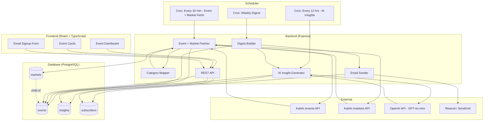
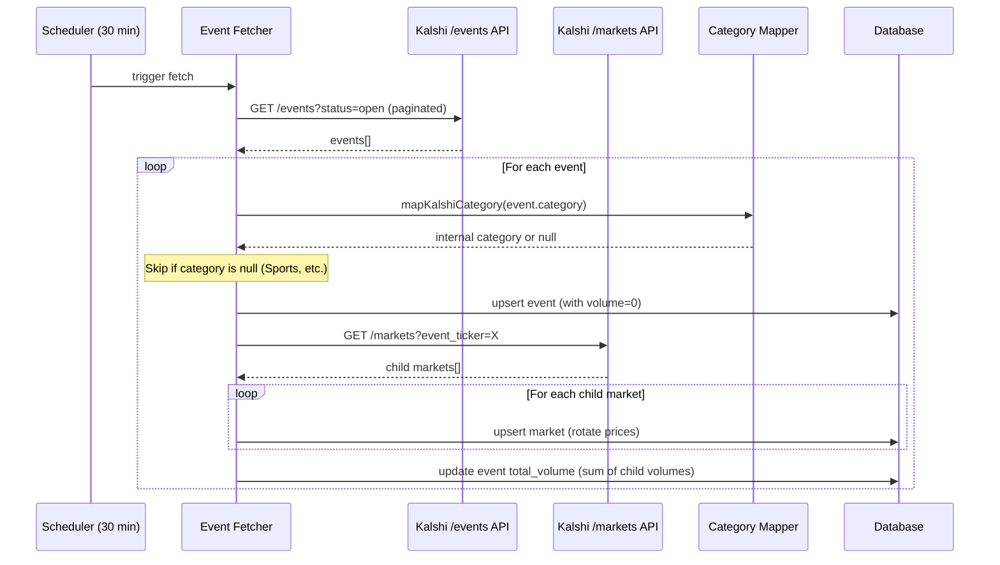
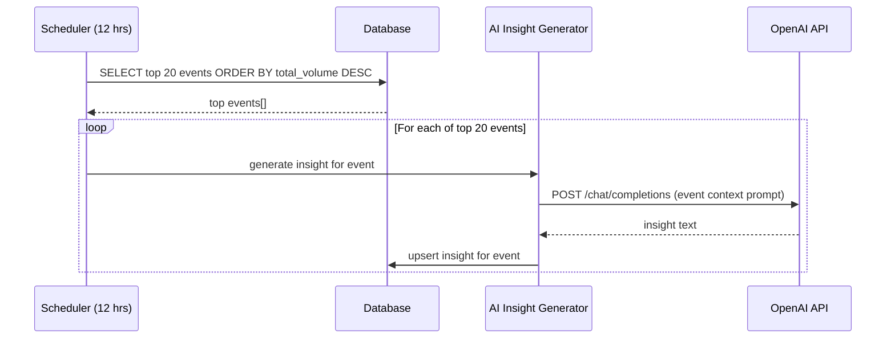
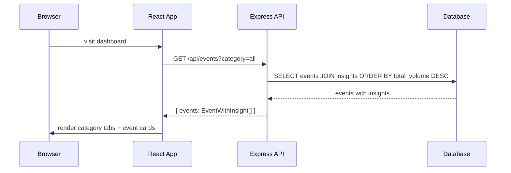
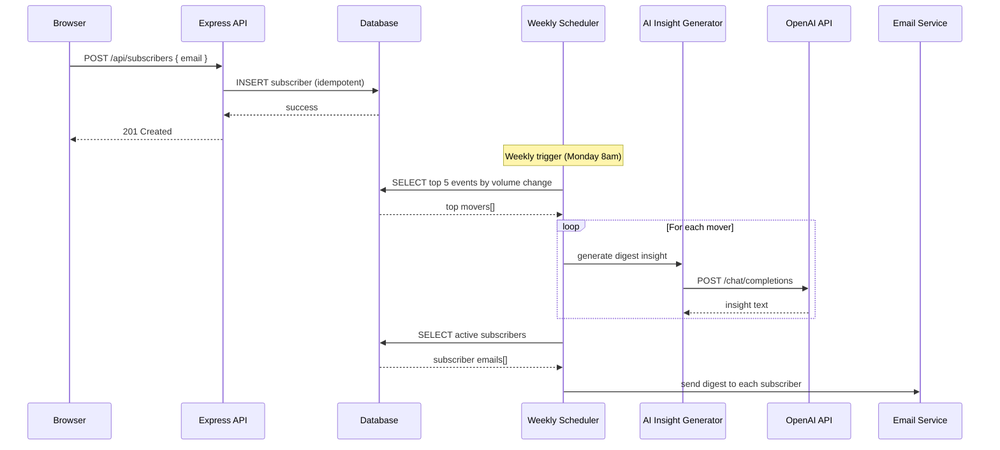

# Prediction Pulse (Trendwise)

A web app that pulls live prediction market data from Kalshi's API, categorizes events by topic, and uses AI to translate raw contract prices into plain-English insights. Built for people who make decisions affected by these outcomes but don't trade on prediction markets.

## Architecture

```
[Scheduler (every 30 min)]
  → Fetch events from Kalshi /events API (with categories)
  → Filter to: Economics, Politics, Climate, Financials
  → Fetch child markets per event from /markets API
  → Sum child volumes → event total volume
  → Store events + markets in PostgreSQL

[Scheduler (every 12 hrs)]
  → Select top 20 events by total volume
  → Generate AI insights per event via OpenAI GPT-4o-mini
  → Store insights in DB

[Express API]
  → GET /api/events?category= → top 20 events by volume with insights
  → POST /api/subscribers → email signup
  → DELETE /api/subscribers/:email → unsubscribe

[React Frontend]
  → Category tabs: Economics, Politics, Financials, Climate
  → Event cards: title, total volume, market count, AI insight
  → Email signup form
  → Auto-refresh every 5 minutes

[Weekly Digest]
  → Top 5 events by volume change
  → Fresh AI insights per event
  → Send to active subscribers via email service
```

## Architecture Diagram



## Sequence Diagrams

### Event + Market Fetch (Every 30 Minutes)



### AI Insight Generation (Every 12 Hours)



### Dashboard Load



### Email Subscription & Weekly Digest


## Data Model

### Events (parent)

```sql
events (
  event_ticker  VARCHAR(255) UNIQUE NOT NULL,  -- "KXFEDRATE-26JUN"
  title         VARCHAR(500) NOT NULL,          -- "Will the Fed cut rates?"
  category      VARCHAR(50) NOT NULL,           -- economics | politics | climate | financials
  total_volume  NUMERIC DEFAULT 0,              -- sum of all child market volumes
  is_mutually_exclusive BOOLEAN DEFAULT FALSE,  -- true = pick one outcome, false = threshold-based
  market_count  INTEGER DEFAULT 0,
  last_updated  TIMESTAMPTZ
)
```

### Markets (children of events)

```sql
markets (
  kalshi_id     VARCHAR(255) UNIQUE NOT NULL,  -- "KXFEDRATE-26JUN-T450"
  event_ticker  VARCHAR(255) REFERENCES events, -- FK to parent event
  title         VARCHAR(500) NOT NULL,          -- specific contract question
  current_price NUMERIC(5,4),                   -- 0.73 = 73% probability
  previous_price NUMERIC(5,4),                  -- for trend calculation
  volume        NUMERIC DEFAULT 0,
  last_updated  TIMESTAMPTZ
)
```

### Insights (per event)

```sql
insights (
  event_ticker  VARCHAR(255) UNIQUE REFERENCES events,
  text          TEXT NOT NULL,                   -- AI-generated, max 60 words
  generated_at  TIMESTAMPTZ
)
```

### Subscribers

```sql
subscribers (
  email         VARCHAR(255) UNIQUE NOT NULL,
  subscribed_at TIMESTAMPTZ,
  active        BOOLEAN DEFAULT TRUE             -- soft delete
)
```

## Event Types

**Mutually Exclusive** (is_mutually_exclusive = true):
- Only one outcome can happen
- Example: "Who will be the next Pope?" → Cardinal A OR Cardinal B
- Child market probabilities roughly sum to 100%

**Non-Mutually Exclusive** (is_mutually_exclusive = false):
- Multiple outcomes can be true simultaneously
- Example: "How high will unemployment get?" → thresholds at 5%, 9%, 12%
- If unemployment hits 12%, the 5% and 9% markets also resolve yes

## Categorization

Uses Kalshi's own category field from the events API. No keyword matching.

| Kalshi Category | Our Category |
|---|---|
| Economics | economics |
| Financials | financials |
| Companies | financials |
| Politics | politics |
| Elections | politics |
| Climate and Weather | climate |

All other Kalshi categories (Sports, Entertainment, etc.) are excluded.

## Tech Stack

| Layer | Choice |
|---|---|
| Frontend | React + TypeScript (Vite) |
| Backend | Node.js + Express |
| Data Source | Kalshi public REST API |
| AI | OpenAI API (GPT-4o-mini) |
| Email | Resend or SendGrid |
| Database | PostgreSQL |
| Scheduler | node-cron |

## Project Structure

```
server/
  src/
    index.ts            -- Express entry point, cron schedulers, middleware
    db.ts               -- PostgreSQL connection pool
    schema.ts           -- Table creation
    types.ts            -- Shared TypeScript types
    categorizeKalshi.ts -- Kalshi category → internal category mapping
    fetchKalshi.ts      -- Fetches events + markets from Kalshi API
    insights.ts         -- OpenAI insight generation
    emailJob.ts         -- Weekly digest builder + sender
    routes.ts           -- Express API routes
    ranking.ts          -- Top event selection by volume
    trend.ts            -- Trend direction calculation
  testData/
    kalshiTestData.ts   -- Script to fetch real Kalshi data for analysis
    kalshiTestData.json -- Saved test data output

client/
  src/
    api.ts              -- Typed API client
    Dashboard.tsx       -- Main dashboard with category tabs
    EventCard.tsx       -- Individual event card component
    EmailSignup.tsx     -- Subscriber form
    App.tsx             -- Root component
```

## Running Locally

```bash
# Install dependencies
npm install

# Set up PostgreSQL
createdb prediction_pulse

# Create server/.env with:
# DATABASE_URL=postgresql://localhost:5432/prediction_pulse
# OPENAI_API_KEY=your-key-here
# FRONTEND_ORIGIN=http://localhost:5173
# PORT=3001

# Start backend (terminal 1)
npm run dev -w server

# Start frontend (terminal 2)
npm run dev -w client

# Visit http://localhost:5173
```

## What's NOT in MVP

- No user accounts or login
- No historical charts or deep analytics
- No real-time WebSocket streaming
- No trading integration
- No mobile app
- No multi-platform aggregation (just Kalshi)
- No personalization


## Component Interfaces

### Event Fetcher

```typescript
interface EventFetcher {
  fetchAndSyncMarkets(): Promise<KalshiEvent[]>
}

interface KalshiEvent {
  eventTicker: string
  title: string
  category: MarketCategory
  totalVolume: number
  isMutuallyExclusive: boolean
  marketCount: number
  lastUpdated: Date
}

type MarketCategory = 'economics' | 'politics' | 'climate' | 'financials'
```

### Category Mapper

```typescript
// Maps Kalshi's category strings to internal categories
function mapKalshiCategory(kalshiCategory: string): MarketCategory | null
```

### AI Insight Generator

```typescript
interface InsightGenerator {
  generateInsight(event: KalshiEvent): Promise<Insight>
  generateTopEventInsights(limit?: number): Promise<Insight[]>
}

interface Insight {
  eventTicker: string
  text: string          // max 60 words, plain English
  generatedAt: Date
}
```

### REST API

```typescript
// GET /api/events?category=:category
// Returns top 20 events by total volume, optionally filtered
interface EventWithInsight {
  eventTicker: string
  title: string
  category: MarketCategory
  totalVolume: number
  isMutuallyExclusive: boolean
  marketCount: number
  lastUpdated: string
  insight: string | null
}

// POST /api/subscribers { email: string } → 201
// DELETE /api/subscribers/:email → 200
```

### Email Digest Service

```typescript
interface DigestService {
  buildAndSendDigest(): Promise<SendResult>
}

interface SendResult {
  sent: number
  failed: number
  errors: string[]
}
```

## Correctness Properties

**P1: Event Volume Integrity**
For all events `e` in the database: `e.total_volume` equals the sum of `volume` across all child markets referencing `e.event_ticker`.

**P2: Price Rotation Integrity**
For all markets `m` after a sync: if `m` existed before with `current_price = X`, then after sync `m.previous_price = X` and `m.current_price` equals the new Kalshi value. For new markets, `previous_price = current_price`.

**P3: Category Mapping Determinism**
For all Kalshi category strings `c`: `mapKalshiCategory(c)` always returns the same result. The function is pure.

**P4: Insight Bound**
For all insights `i`: `wordCount(i.text) <= 60`.

**P5: Subscriber Idempotency**
For all emails `e`: calling `addSubscriber(e)` multiple times results in exactly one active subscriber record.

**P6: Digest Bounded Size**
For all digest operations: the digest contains at most 5 events.

**P7: Price Range Validity**
For all markets `m` in the database: `0 <= m.current_price <= 1` and `0 <= m.previous_price <= 1`.

**P8: Subscriber Email Uniqueness**
No two subscriber records share the same email address.

**P9: Digest Delivery Accounting**
For all digest sends with result `r` and `n` active subscribers: `r.sent + r.failed = n`.

**P10: Event-Market Referential Integrity**
For all markets `m` in the database: `m.event_ticker` references an existing event.

## Error Handling

### Kalshi API Unavailable
Log error, skip fetch cycle. Dashboard serves stale data. Next 30-min cron retries automatically.

### OpenAI API Failure
Log error, skip that event's insight. Event card displays without insight. Other events continue independently.

### Invalid Email Submission
Return HTTP 400. Store nothing. Frontend validates format before submission.

### Email Delivery Failure
Log failure, continue sending to remaining subscribers. No retry within same digest run.

### Database Connection Lost
All API endpoints return HTTP 503. Scheduler operations fail and log. Connection pool auto-reconnects.

### Kalshi Market Data Malformed
Skip the malformed market, log warning. Process remaining markets normally.

### Kalshi Rate Limit (429)
Log error, stop pagination. Use data fetched so far. 300ms delay between API calls prevents most rate limiting.

## Performance Notes

- **Kalshi API**: 300ms delay between paginated requests. Max 5 pages of events (1000 events). Rate limit safe.
- **OpenAI costs**: ~6,000 tokens/day for 20 event insights. ~$0.05/month with GPT-4o-mini.
- **Database**: Events table stays small (hundreds of rows). Markets table larger but indexed by event_ticker FK.
- **Frontend**: Auto-refresh every 5 minutes. No WebSocket overhead.
- **Email**: Weekly batch to subscribers. Use batch sending if service supports it.
